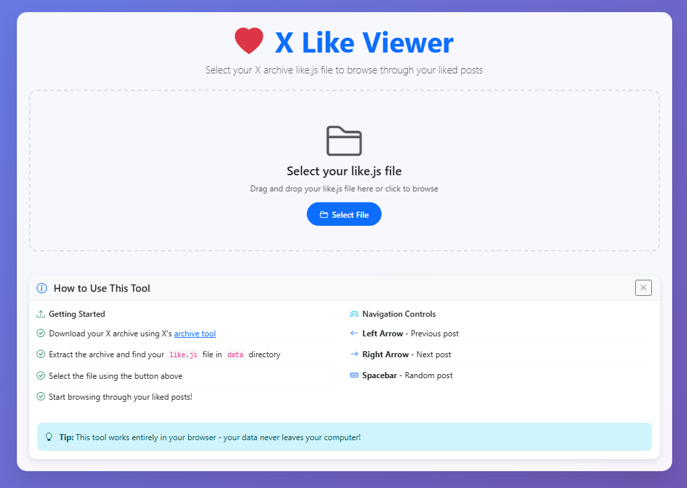
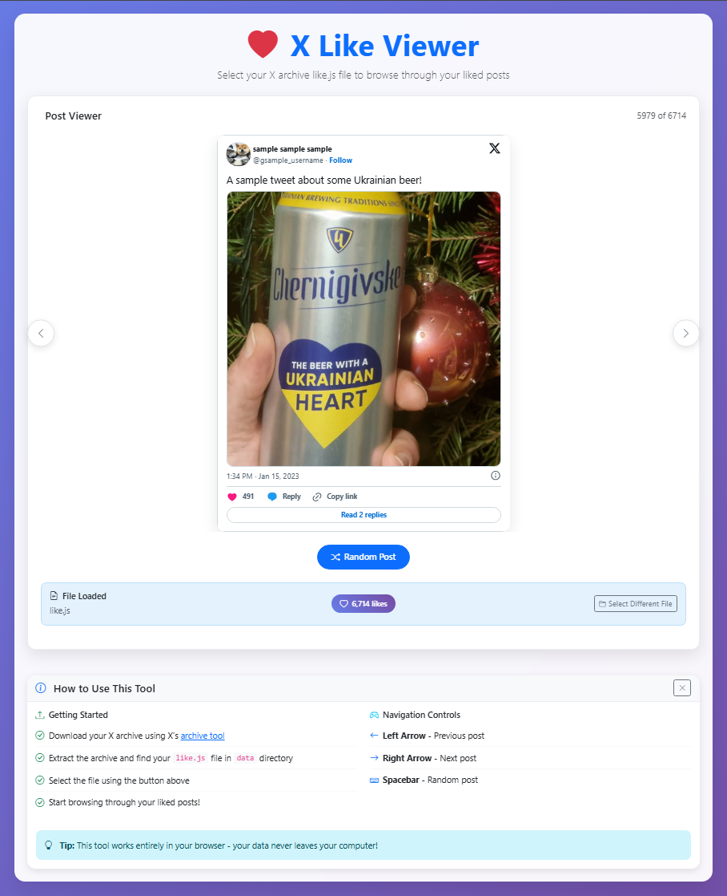

# [LikeViewer.app ❤️](https://likeviewer.app)

A website to browse and view your X (Twitter) likes using your X archive data. Completely offline - your data never leaves your device.




## ✨ Features

- **🔒 Privacy First**: Completely offline - your data never leaves your device
- **📱 Responsive Design**: Works on desktop, tablet, and mobile devices
- **🎯 Easy Navigation**: Browse through your likes with previous/next buttons or random selection
- **⚡ Fast Performance**: Efficiently processes large like.js files
- **🎨 Modern UI**: Clean, intuitive interface built with Bootstrap
- **⌨️ Keyboard Navigation**: Use arrow keys to navigate between posts
- **📊 File Statistics**: View total likes count and file information

## 🚀 Quick Start

### Prerequisites

- A web server with PHP support (or use a local development server)
- Your X archive `like.js` file

### Installation

1. **Clone the repository**
   ```bash
   git clone https://github.com/swiftyspiffy/likeviewer.app.git
   cd likeviewer.app
   ```

2. **Set up a local server**
   ```bash
   php -S localhost:8000
   ```

3. **Open your browser**
   Navigate to `http://localhost:8000`

## 📥 Getting Your X Archive Data

To use this tool, you'll need to download your X archive:

1. **Request your X archive**:
   - Go to [X Settings](https://twitter.com/settings/account)
   - Navigate to "Your Account" → "Download an archive of your data"
   - Enter your password and request the archive
   - X will email you when your archive is ready (usually takes 24-48 hours)

2. **Download and extract**:
   - Download the ZIP file from the email
   - Extract the archive
   - Look for the `like.js` file in the extracted folder

3. **Use with X Like Viewer**:
   - Open the web app in your browser
   - Drag and drop or select your `like.js` file
   - Start browsing your likes!

## 🎯 How to Use

1. **Upload your like.js file**:
   - Drag and drop your `like.js` file onto the upload area, or
   - Click "Select File" to browse and choose your file

2. **Browse your likes**:
   - Use the **← →** navigation buttons to move between posts
   - Click **Random Post** to jump to a random like
   - Use your keyboard arrow keys for navigation

3. **View post details**:
   - Each post displays with full context
   - Embedded tweets show media, replies, and engagement
   - File statistics show total likes count

## 🛠️ Technical Details

- **Frontend**: HTML5, CSS3, JavaScript (ES6+)
- **UI Framework**: Bootstrap 5.3.0
- **Icons**: Bootstrap Icons
- **Backend**: PHP (for file processing)
- **Dependencies**: None - pure vanilla JavaScript and Bootstrap CDN

### File Structure

```
likeviewer.app/
├── index.php          # Main application file
├── script.js          # JavaScript functionality
└── styles.css         # Custom styling
```

## 🔧 Browser Compatibility

- ✅ Chrome 90+
- ✅ Firefox 88+
- ✅ Safari 14+
- ✅ Edge 90+

## 📝 License

This project is licensed under the MIT License - see the [LICENSE](LICENSE) file for details.
